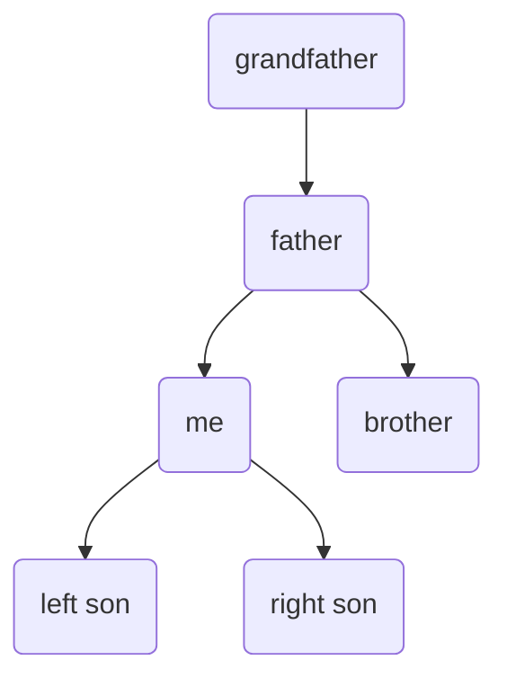
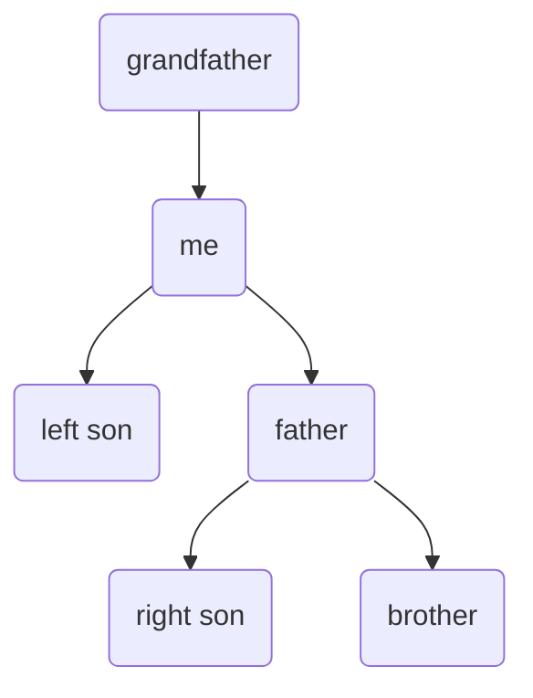
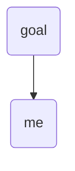
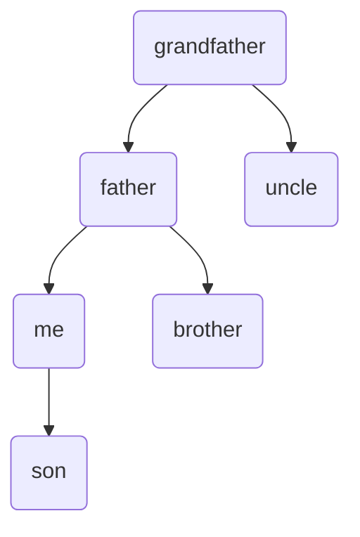
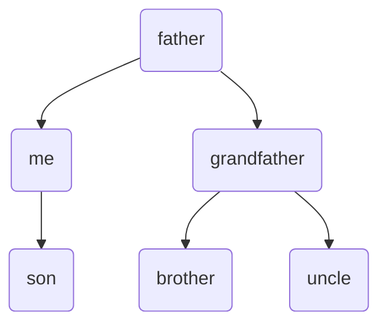
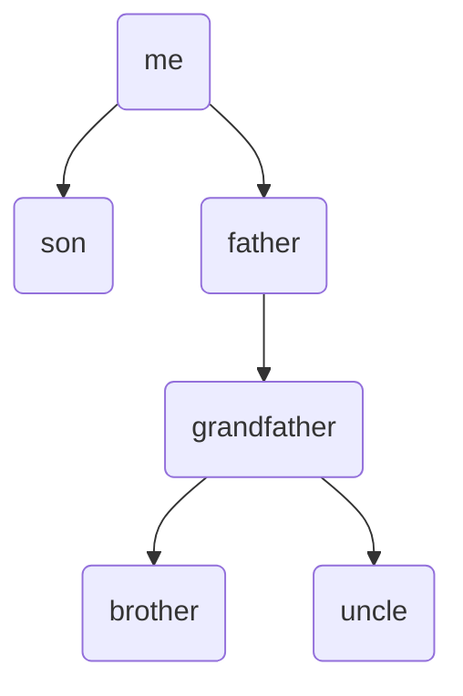
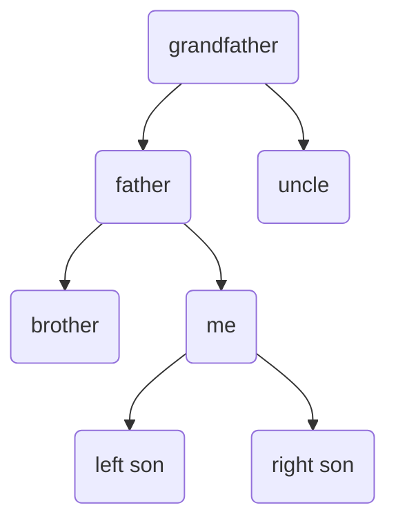
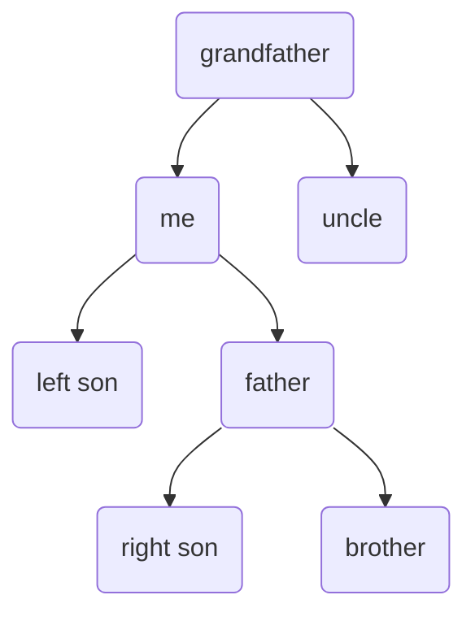
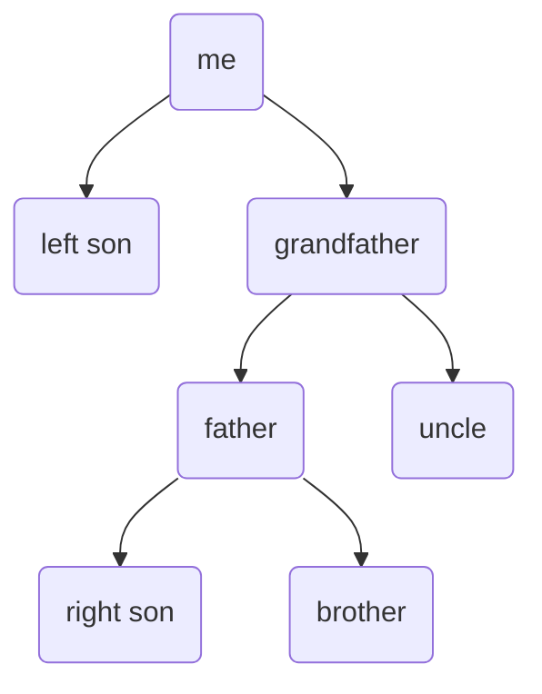

此处将会介绍史上最详尽的splay树学习笔记（无指针版本）。

前置芝士：BST（二叉搜索树）。

# splay树

## 基础函数

* pushup(int) 向上更新

* pushdown(int) 向下更新

* get(int) 判断此结点是左儿子还是右儿子

## rotate 旋转

这是splay树的核心操作中的核心操作。

因为我们要把结点弄到根，正所谓千里之行始于足下，我们要先把它弄到它的父亲结点。

rotate分为两种，左旋和右旋，分别对应当前结点是左儿子还是右儿子的情况。

右儿子就是左儿子反过来了。



旋转后变为：



可以发现其中序遍历不变，但是改变了他的局部结构。

代码：

```c++
void rotate(int o,int &goal)
{
    int fa=t[o].fa,gr=t[fa].fa,type=get(o);
    if(fa==goal) goal=fa;
    else t[gr].son[get(fa)]=o;
    t[o].fa=gr;
    t[t[o].son[type^1]].fa=fa;
    t[fa].son[type]=t[o].son[type^1];
}
```

## splay 伸展

这是伸展树的核心操作。

伸展操作有几种情况：

####  差一步

father是目标结点



此时只要一次左/右旋即可。

#### 一字型

me与father同侧



此时需要先旋转一次father:



再旋转一次me:


####  之字形

me和father异侧



此时先转一次me：



再转一次me：


```c++
void splay(int x,int goal=root)
{
    while(x!=goal)
    {
        if(T[x].fa!=goal) rotate(get(x)==get(T[x].fa)?T[x].fa:x);
        rotate(x);
    }
    if(goal==root) root=x;
}
```

## find 寻找

即寻找原数列中下标为i的元素在splay中的存储位置。

通过size可以轻松实现

# Link/Cut Tree

一种数据结构，splay的拓展。

### 动态树问题

要求写一个数据结构维护一棵树上的各种东西，比如修改或查询路径上或子树内的权值。

以上的操作都可以用普通的树剖实现，

但是当你需要实现连接(link)或断开(cut)一条边时，你便需要LCT(link/cut tree)了！

### 实链剖分

因为我们的树的形态现在变来变去，而树链剖分（重链剖分和长链剖分）是静态不可变的，所以我们决定改进一下。

对于一个点的所有儿子，我们**自己选择**一个儿子，称为实儿子，连向它的边称为实边，其他边则为虚边，实边构成的链称为实链。

普通的树链剖分一般用线段树进行维护区间，而这里，我们使用更为灵活的splay来维护实链的区间信息。

具体来说，我们使用一棵splay以维护一条实链。splay的中序遍历是实链从上到下的遍历。

splay的根节点的父亲指向链的顶端的父亲节点，当然链的顶端的父亲节点没它这个儿子。这样的一条边对应原树中的一条虚边。

理论结束，魔法展开~

### 基础函数

```c++
inline bool is_root(int x)//判断这个节点是不是根。
{return T[T[x].fa].son[0]!=x&&T[T[x].fa].son[1]!=x;}//因为我们之前说过“链的顶端的父亲节点没它这个儿子:)
inline void update(int p)
{
    if(!is_root(p)) update(f[p]);//从上到下一层一层地pushdown
 	pushdown(p);
}
```

### rotate 旋转操作

```c++
void rotate(int x)
{
    int fa=T[x].fa,grandpa=T[fa].fa;
    bool type=get(x);pushdown(fa),pushdown(x);
    if(!is_root(fa)) T[grandpa].son[get(fa)]=x;T[x].fa=grandpa;//注意，这里是分号。
    T[fa].son[type]=T[x].son[type^1];T[T[x].son[type^1]].fa=fa;
    T[x].son[type^1]=fa;T[fa].fa=x;
    pushup(fa),pushup(x);
}
```

### splay 伸展操作

```c++
void splay(int x)
{
    update(x);
    while(x!=goal)
    {
        if(!is_root(T[x].fa)) rotate(get(x)==get(T[x].fa)?T[x].fa:x);
        rotate(x);
    }
}
```

### access 访问操作

为了得到我们需要的信息，我们需要把根节点到x的边全部放在一棵splay里，也就是把根节点到x的路径转化成实链。

这是LCT的核心操作。

假若我们有这样一棵树，实线为实边，虚线为虚边。


它的辅助树可能长成这样（构图方式不同可能 LCT 的结构也不同）。


现在我们要 access(N)，把A到N路径上的边都变为实边，拉成一棵Splay。

同时我们需要的是A到N路径上的数据，而不包括O，所以把节点O弄成虚儿子。


为了方便，我们需要让N成为它所在的Splay的根节点。

为了把节点O弄成虚儿子，我们直接把N的儿子（右儿子，因为Splay的中序遍历对应实链从上到下的遍历）设成空即可。

然后（辅助树）变成了这样：


同样，我们需要让N现在的父亲I成为它所在的Splay的根节点。

而原本的实边I-K也要变成虚边，虚边I-L要变成实边。

于是我们直接把I的右儿子指向N。


重复这样的操作直到当前的点为原树的根节点。

```c++
void access(int x)
{
    int p=0;//记录上一次操作的Splay的根节点。
    for(;x;p=x,x=T[x].fa)
        splay(x),T[x].son[1]=p,pushup(x);
    return p;//返回值是最终的Splay的根节点。
}
```

### make_root 换根操作

让指定的点成为原树的根节点

我们看到通过access操作我们获得了从根到p的一棵Splay。它的中序遍历对应着从根到p的路径。

而如果我们把树用有向图来表示（父亲指向儿子），那么换根就相当于把从根节点到p的有向边调转方向，对吧？

也就是把Splay的中序遍历改成从p到根的路径

欸这不就是区间反转吗

```c++
void make_root(int p)
{
    p=access(p);
    T[p].rev^=1;
}
```

### link/cut 连接/删除操作

很简单

```c++
void link(int x,int y)
{
    make_root(x);
    splay(x);
    T[x].fa=y;
}
void cut(int x,int y)
{
    make_root(x);
    access(y);
    splay(y);
    T[y].son[0]=T[x].fa=0;
}
```

### get_ans 查询操作

得到x到y的答案。也很简单

```c++
node get_ans(int x,int y)
{
    make_root(x);
    return T[access(y)];
}
```

### 处理边权

拆边，对于每条边建一个对应的点。即可把边权转化为点权。

